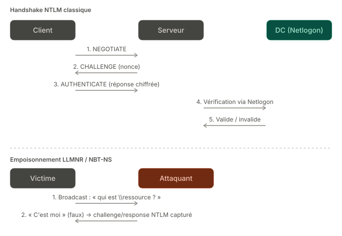

# NTLM, LLMNR & NBT-NS

## Role in Active Directory
**NTLM (NT LAN Manager)** is an authentication protocol older than Kerberos, based on a challenge-response system rather than tickets. It remains in use as a fallback when Kerberos isn't possible — for example, access by IP address, absence of an SPN, or a non-domain environment.

**LLMNR (Link-Local Multicast Name Resolution)** and **NBT-NS (NetBIOS Name Service)** are name-resolution protocols used as a fallback when DNS fails to resolve a hostname on the local network.

## Key definitions
- **NTLM hash**: a fingerprint of the user's password, stored on the machine and on the DC — never the plaintext password.
- **Netlogon**: the channel a domain-member server uses to have an NTLM challenge validated by the domain controller.
- **LLMNR**: a fallback protocol, works via multicast on UDP port 5355.
- **NBT-NS**: an older fallback protocol, works via broadcast on UDP port 137.
- **Poisoning**: responding to an LLMNR/NBT-NS request by pretending to be the requested resource, when you're not the right machine.

## How it works

### NTLM (3-step handshake)
1. **NEGOTIATE** — the client tells the server which capabilities it supports.
2. **CHALLENGE** — the server replies with a random number (the "challenge" or "nonce").
3. **AUTHENTICATE** — the client encrypts this challenge with its NTLM hash and sends back the result. If the target server is not itself the DC, it forwards the challenge and response to the DC via Netlogon for verification (only the DC holds the hashes).

### LLMNR / NBT-NS (fallback name resolution)
1. A user mistypes a share name, or DNS fails to respond (e.g. `\\floor2-printer\`).
2. The machine sends a **broadcast/multicast** request on the local network: "Who is named `floor2-printer`?"
3. **Any machine on the network can reply** "that's me" — LLMNR/NBT-NS does not verify the identity of whoever responds at all.
4. The victim, believing it's talking to the right machine, sends it an NTLM challenge to authenticate (for example, to access the requested share).

## Exploited weaknesses
- Any machine can respond to an LLMNR/NBT-NS request and intercept an NTLM challenge/response → [`attacks/02-credential-capture/llmnr-nbtns-poisoning.md`](../../attacks/02-credential-capture/llmnr-nbtns-poisoning.md) (the technique used by the **Responder** tool)
- The captured NTLM challenge/response can be cracked offline, or relayed live to another machine without even cracking it → [`attacks/02-credential-capture/smb-relay.md`](../../attacks/02-credential-capture/smb-relay.md)
- NTLM offers no replay protection unless signing is enforced → enables lateral movement via [`attacks/04-lateral-movement/pass-the-hash.md`](../../attacks/04-lateral-movement/pass-the-hash.md) (the NTLM hash alone is enough to authenticate, without knowing the plaintext password)

## Defensive takeaways
- Disable LLMNR (via Group Policy) and NBT-NS (via network configuration) if not needed
- Enforce SMB/LDAP signing to prevent relaying of captured credentials
- Disable NTLMv1 (vulnerable), allow only NTLMv2
- Monitor for abnormal LLMNR/NBT-NS traffic (a sign of a tool like Responder active on the network)

## References
-
